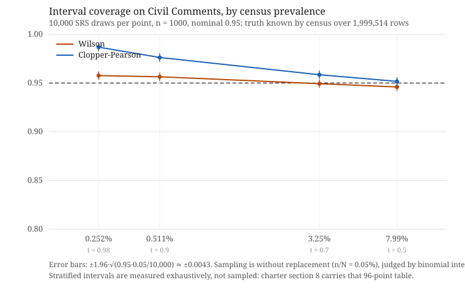

# prevalence-kit

**Pre-release. Phase 3 of 4 in progress. Nothing here is ready to rely on yet.**

Audit-grade prevalence measurement for Trust & Safety.

You give it a sampling plan and human labels. It gives back a prevalence estimate, an honest
confidence interval, a sealed copy of the content, a tamper-evident record of every step, and a
stamped report.

**No AI ever touches the evidence or the estimate.**

## Does the method hold? Checked against a truth anyone can recompute

Civil Comments (CC0, 1,999,514 rows) carries continuous human annotation scores, so once a
threshold is fixed the true prevalence is knowable **by census**. Four thresholds were
pre-registered and hashed **before the corpus was fetched** — the commitment is
[`demo/preregistration.json`](demo/preregistration.json), and the commit that carries it predates
the download. Then 10,000 simple random samples of n = 1000 per threshold, each judged by both
shipped intervals against the census truth.

Clopper-Pearson covered at or above its nominal 95% at all four points, paying in width as the
rate rarefies. Wilson oscillates around nominal and dips measurably below it. The full account —
census counts, coverage tallies, digests, and what these four points do *not* establish — is
[`demo/READING.md`](demo/READING.md). One run also went through the full sealed chain,
pre-registration to stamped report, on real comment text:
[`demo/full_chain/report.md`](demo/full_chain/report.md), with `verify` returning nine checks
and exit 0.

Platforms that publish prevalence this way cannot publish this demonstration, because their
truths are confidential. This one is reproducible by anyone.

## What this is, and what it is not

**It is the governance, label-quality and audit layer.** Pre-registration, sealed content, a
chain that can say no, and a report an auditor can check.

**It is not a survey-statistics library, and [`svy`](https://github.com/samplics-org/svy) is
the estimator layer.** `svy` covers stratified sampling, Neyman allocation, Wilson and
Clopper-Pearson intervals, Taylor linearization, post-stratification, and it is good.
R [`survey`](https://cran.r-project.org/package=survey) has covered this ground since 2003.
**Our estimators are validated against both**, and we do not claim to fill an estimator gap,
because there isn't one. We ship our own lean implementations for one recorded reason: `svy`
depends on an HTTP client, and this tool proves *zero network capability at runtime* with a
test that would fail the moment one entered the dependency tree.

What neither library does is seal content, keep a tamper-evident record, or refuse to print a
number it cannot defend. That is the gap.

## Six verbs

| Verb | What it does |
|---|---|
| `plan` | Hash the measurement plan before any data is touched. Pre-registration: the plan cannot quietly change after results are seen |
| `sample` | Draw the sample the plan describes — simple random, or stratified with Neyman allocation — deterministically under the recorded seed |
| `ingest-labels` | Read human labels; **seal the content on ingest**. Encrypted at rest, safe preview only, every unseal logged |
| `estimate` | Compute prevalence with the interval **the plan names — there is no default**, and an optional Rogan–Gladen correction from pre-registered sensitivity and specificity. Refuses, by name, rather than print a number it cannot defend |
| `verify` | Re-check the whole chain: plan hash, sample redraw, ledger integrity, estimate recomputation. It can say no, so its yes means something |
| `emit-report` | Stamped Markdown and JSON with every hash and a mandatory Honest Limits block |

The shipped example under [`examples/synthetic/`](examples/synthetic) runs the whole chain in
seconds.

## At the rates this tool is for, several ordinary intuitions fail

These are one fact family, not scattered caveats, and every one was met in the artifacts rather
than reasoned into being.

- **An ordinary-sounding specificity makes the correction undefined, not imprecise.** At an
  apparent prevalence of 0.2%, the Rogan–Gladen correction needs specificity above **99.8%**.
  "99%" sounds excellent — and at that rate produces five times more apparent positives from
  clean content than the whole sample held, driving the corrected estimate negative. The tool
  refuses and names the figure you need.
- **A rare-event measurement that finds nothing is the product, not a failure.** Zero positives
  with a good test yields a point estimate of 0 and a real, defensible upper bound. The tool
  prints it. (An early design would have refused this as "no information"; it was struck.)
- **Under a stratified design at rare rates, the interval frequently does not exist at all** —
  every unit comes back negative, the design standard error is zero, and there is nothing to
  invert. `sample` computes those odds in closed form from the plan's own expectations and says
  them **before the label budget is spent**.
- **A corrected interval's lower bound can go negative while the estimate is fine.** The tool
  clamps to [0, 1], **says so in the output**, and keeps the raw bound in the ledger so an
  auditor sees what the arithmetic produced before policy touched it.
- **The interval you choose has a coverage cost, and at rare rates it is large.** Ask for a 95%
  Wilson interval and you can get one that covers **as little as 90.98%** of the time at the
  rates this tool is built for — measured, not asserted, and rounded *down* because a bound is
  rounded in the direction that keeps it true. Clopper-Pearson holds its level and is wider for
  it. **That is why the plan must name the method: a default would be this project choosing,
  for an operator who did not know there was a choice.**

## Honest limits

- It measures prevalence of labeled samples from a defined population. It **cannot fix a bad
  sampling frame, biased labels, or a dishonest plan.** It can only make them visible and
  permanent in the record.
- **Interval guarantees are sampling-only.** They do not account for rater quality — the same
  caveat YouTube publishes for its Violative View Rate.
- **The corrected interval treats the sensitivity and specificity you supply as exact.** The
  method that propagates their uncertainty (Lang & Reiczigel 2014) is a plan-schema change,
  deliberately not in v1.0.
- **The stratified intervals do not hold their nominal level, and at rare rates the gap is
  large** — measured by exhaustive enumeration, with the 96-point table in the
  [charter §8](PROJECT_CHARTER.md). Korn–Graubard is the better of the two and still does not
  hold. Neither is Clopper-Pearson, whose guarantee does not survive the approximation.
- **What we ship is limited by what we can witness.** Our own anchor recommends Jeffreys and
  Agresti–Coull; neither has a witness in the libraries we validate against, so we ship
  neither. The methods here are the ones we can prove, not the ones the anchor prefers.
- **No EU regulation requires the number this tool produces.** The word "prevalence" appears
  zero times in the Digital Services Act and zero times in Implementing Regulation (EU)
  2024/2835. What those do mandate is classifier accuracy, precision and recall — and, in the
  guidance, sensitivity and specificity. This tool shows what those mandated quantities do to a
  prevalence estimate.
- Validation is on synthetic data and one public dataset. **No claim of production deployment.**
- Built by directing an AI under a governed process. The director wrote none of the code and
  all of the decisions, and the record below — including a corrections register that counts the
  errors by who made them — is part of the deliverable.

## Not in v1.0

Not a classifier, detector, or moderation system — it measures and never judges content. Not a
survey-statistics library. No dashboards, no daemon, no cloud: a CLI that reads files and
writes files. No importance sampling or ML-assisted weights. No DSA-shaped report emitter.

## The record

Every claim above is checked against a primary source and pinned by version, date or DOI.

| | |
|---|---|
| [`PROJECT_CHARTER.md`](PROJECT_CHARTER.md) | What is being built, and the cap on it |
| [`docs/PHASE-0-VERIFICATION.md`](docs/PHASE-0-VERIFICATION.md) | 24 claims checked; 6 defects found and recorded |
| [`docs/STANDARDS.md`](docs/STANDARDS.md) | Every source, pinned |
| [`docs/DECISIONS.md`](docs/DECISIONS.md) | Why each choice was made, and what was rejected |
| [`docs/CORRECTIONS.md`](docs/CORRECTIONS.md) | What we got wrong, and where it came from |
| [`SECURITY.md`](SECURITY.md) | What it protects, from whom, and what it does not |

## Licence

MIT.
